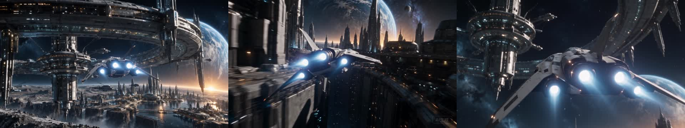
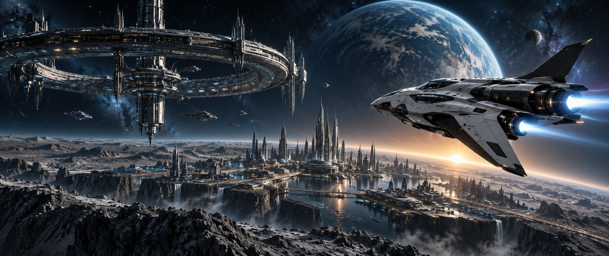

<div align="center">

# Mouva Video

### 创造世界，导演动作，完成你的电影。

从雨夜里的武侠交锋，到驶向深空的探索飞船。

把灵感、可编辑 3D 动作和 AI 镜头连接起来，在同一工作区完成你的故事。

[**进入 Mouva Video ↗**](https://video.mouva.ai/) · [中文画布教程](https://video.mouva.ai/?section=learn&lang=zh) · [本地运行](#本地运行)

[](https://raw.githubusercontent.com/leoyounghel-bot/mouva-video/main/docs/showcase/space-travel/film-1080p.mp4)

**[观看 / 下载《太空旅行》1080p 成片](https://raw.githubusercontent.com/leoyounghel-bot/mouva-video/main/docs/showcase/space-travel/film-1080p.mp4)** · 24 秒 · 三个连续镜头 · 配乐与引擎声

<sub>封面来自实际生成的视频。成片没有添加介绍文字、标题或字幕，保留 AI 生成标识。</sub>

</div>

## 作品放映厅

<table>
<tr>
<td width="50%" valign="top">

### 太空旅行

[](https://raw.githubusercontent.com/leoyounghel-bot/mouva-video/main/docs/showcase/space-travel/film-1080p.mp4)

空间站 → 星际城市 → 未知深空。三个镜头，串起一段 24 秒的太空旅程。

**[观看 1080p 成片 ↗](https://raw.githubusercontent.com/leoyounghel-bot/mouva-video/main/docs/showcase/space-travel/film-1080p.mp4)** · [3D 动作预演](docs/showcase/space-travel/motion-preview.glb)

</td>
<td width="50%" valign="top">

### 雨门交锋

[](https://raw.githubusercontent.com/leoyounghel-bot/mouva-video/main/public/learn/wuxia/ai-film.mp4)

两位剑客在雨夜交锋。保留原有武侠案例、可编辑 3D 动作与画布练习。

**[观看武侠 AI 成片 ↗](https://raw.githubusercontent.com/leoyounghel-bot/mouva-video/main/public/learn/wuxia/ai-film.mp4)** · [进入中文教程](https://video.mouva.ai/?section=learn&lang=zh)

</td>
</tr>
</table>

《雨门交锋》包含八镜头、32 秒的可编辑 3D 序列，以及独立生成的 12 秒、720p AI 视频。AI 成片是平面视频，角色不是从视频中恢复的可编辑模型。教程支持调整时序、比较候选和导出。

---

## 新作品：太空旅行

一艘探索飞船接近巨型环形空间站，穿过异星城市的高楼与空中航道，最后加速驶向未知深空。作品以欧美科幻电影风格为方向，用冷色金属、行星晨光和推进器光芒连接三个镜头。



| 时间 | 镜头 | 画面与动作 |
| --- | --- | --- |
| **00:00–00:08** | 空间站接近 | 飞船靠近行星上方的巨型空间站，逐步展现轨道设施与城市尺度。 |
| **00:08–00:16** | 星际城市掠飞 | 飞船穿行于未来城市的高层建筑之间，镜头跟随推进器进入城市航道。 |
| **00:16–00:24** | 飞船驶向深空 | 飞船离开轨道设施，加速飞向开阔宇宙，结束这段太空旅程。 |

三个镜头分别生成后，拼接为 1920 × 1080、24 fps 的 MP4。前两段原片为 720p，合片时放大至 1080p；第三段为原生 1080p。

**[下载可编辑 3D 动作预演（GLB）](docs/showcase/space-travel/motion-preview.glb)**：包含飞船、环形空间站、城市和相机动画。这份 3D 场景独立制作，没有参与本案例三个 AI 镜头的生成，也不是从成片反向还原的模型。

<details>
<summary>查看太空世界概念图</summary>



这张图是项目的科幻视觉概念参考，视频封面及上方成片链接展示实际生成结果。

</details>

## 一个工作区，完成四步创作

| 创作阶段 | 工作区能力 |
| --- | --- |
| **搭建画布** | 连接图片、视频、音频和可编辑 3D 节点，把参考素材组织成镜头计划。 |
| **导演场景** | 用 AI 导演规划镜头，创建或调整 3D 对象、相机与时间设置。 |
| **探索动作** | 渲染运动参考，通过已配置的模型生成视频候选，比较版本后选择采用。 |
| **完成剪辑** | 将采用的镜头排入时间线，编辑音频与字幕，通过渲染服务导出 MP4 或 WebM。 |

从参考图和清晰的镜头描述开始，逐个镜头建立统一世界，再选择适合叙事的版本。工作区提供本地项目存储和双语教程；可编辑 3D 场景与 AI 生成的平面视频是不同的输出形式。


## 开始创作

1. **新建项目**：输入名称，选择横屏、竖屏或方形画幅。
2. **组织素材**：用画布底部的「＋」添加图片、视频、音频或 3D 节点，拖动端口连接参考素材。
3. **制作镜头**：输入镜头描述，调整场景与动作，比较候选并选择采用的版本。
4. **剪辑导出**：把镜头加入时间线，调整顺序、时长、配乐与字幕，再导出成片。

需要操作帮助时，打开工作区里的学习入口，或阅读[完整操作指南](docs/usage.md)。

## 本地运行

需要 Node.js 24.11 或更新版本；渲染功能需要 Chromium 和 FFmpeg。

```sh
npm ci
cp .env.ai.example .env.ai
npm run dev
```

启动后打开 <http://127.0.0.1:5173>。渲染路径与生成服务的配置见[本地开发说明](docs/local-development.md)。

## 文档导航

| 你想了解 | 文档入口 |
| --- | --- |
| 画布、素材、镜头和时间线怎么用 | [操作指南](docs/usage.md) |
| 本地配置、构建和测试 | [本地开发说明](docs/local-development.md) |
| 如何部署独立服务 | [部署文档](docs/deployment.md) |
| 线上积分如何结算 | [计费说明](docs/billing.md) |
| 如何保管配置和报告安全问题 | [安全说明](SECURITY.md) |

## 开源说明

本仓库仅包含 Mouva Video，采用 [Apache-2.0 许可证](LICENSE)。主账号服务和其他 Mouva 产品不在此仓库范围内。

仓库保留源码、测试、依赖锁定文件，以及太空旅行和武侠案例。私有环境配置、密钥、用户项目、运行数据和本地归档不随源码公开。提交前运行 `npm run check:public` 检查。

依赖许可见[第三方声明](THIRD_PARTY_NOTICES.md)，内置字体许可见[字体许可文件](public/fonts/OFL.txt)。
