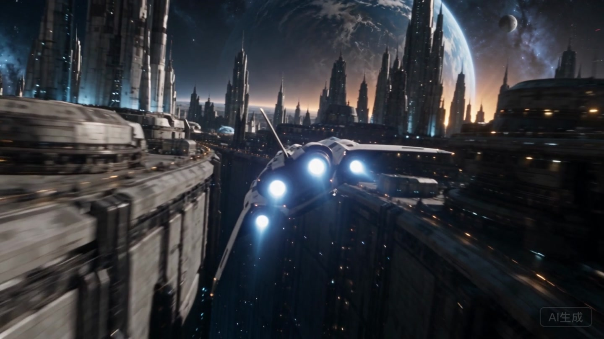
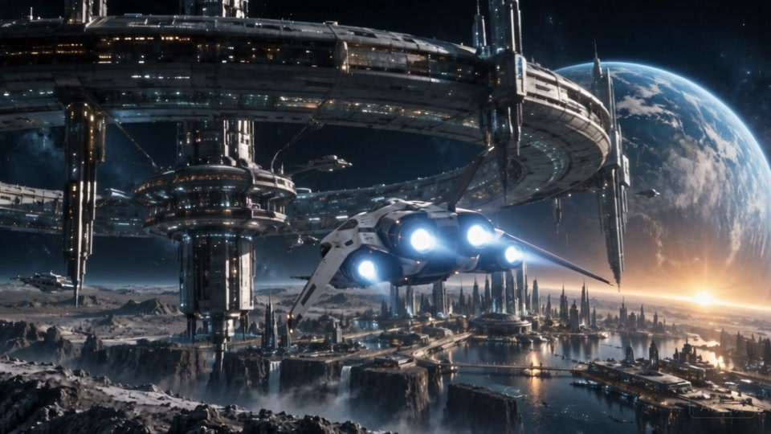
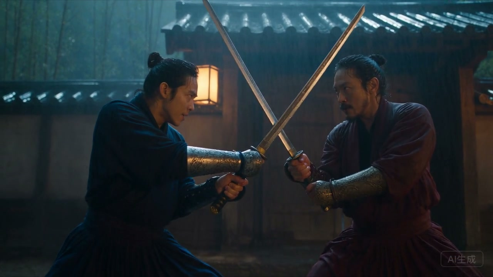

[English](README.md) · [简体中文](README.zh-CN.md) · **[繁體中文](README.zh-TW.md)** · [日本語](README.ja.md) · [Español](README.es.md)

# Mouva Video

### 創造世界，導演動作，完成你的電影。

從雨夜裡的武俠交鋒，到駛向深空的探索飛船。
把靈感、3D 動作和 AI 鏡頭連接起來，在同一工作區完成你的故事。

[**開始創作 ↗**](https://video.mouva.ai/?lang=zh) · [作品發佈頁](https://github.com/leoyounghel-bot/mouva-video/releases/tag/showcase-20261005) · [操作指南（簡體中文）](docs/usage.md)

## 作品放映廳

<table>
<tr>
<td width="50%" valign="top">

### 太空旅行

太空站 → 星際城市 → 未知深空。
三個鏡頭，24 秒的太空旅程。

**[觀看 / 下載成片 ↗](https://github.com/leoyounghel-bot/mouva-video/releases/download/showcase-20261005/space-travel-1080p.mp4)** · [備用下載](https://raw.githubusercontent.com/leoyounghel-bot/mouva-video/67a4ac913a7512ea02b16723838a7a701c48ccc4/docs/showcase/space-travel/film-1080p.mp4) · [3D 動作預演](https://github.com/leoyounghel-bot/mouva-video/releases/download/showcase-20261005/space-travel-motion.glb)

</td>
<td width="50%" valign="top">

### 雨門交鋒

雨夜、劍客、交鋒。
探索武俠成片、3D 動作與畫布練習。

**[觀看 / 下載成片 ↗](https://github.com/leoyounghel-bot/mouva-video/releases/download/showcase-20261005/wuxia-ai-film.mp4)** · [進入教學](https://video.mouva.ai/?section=learn&lang=zh)

</td>
</tr>
</table>

成片、3D 預演和畫質說明統一放在 [作品發佈頁](https://github.com/leoyounghel-bot/mouva-video/releases/tag/showcase-20261005)。

## 你的創作流程

**組織素材 → 導演鏡頭 → 比較候選 → 剪輯匯出**

連接圖片、音訊、影片和可編輯 3D 節點，逐個鏡頭建立你的世界，再用時間軸完成配樂、字幕與剪輯。

## 開始使用

[線上創作](https://video.mouva.ai/?lang=zh) · [操作指南（簡體中文）](docs/usage.md) · [本機執行（簡體中文）](docs/local-development.md) · [部署文件](docs/deployment.md)

---

本儲存庫僅包含 Mouva Video，採用 [Apache-2.0 授權條款](LICENSE)。
[安全說明](SECURITY.md) · [第三方聲明](THIRD_PARTY_NOTICES.md)
